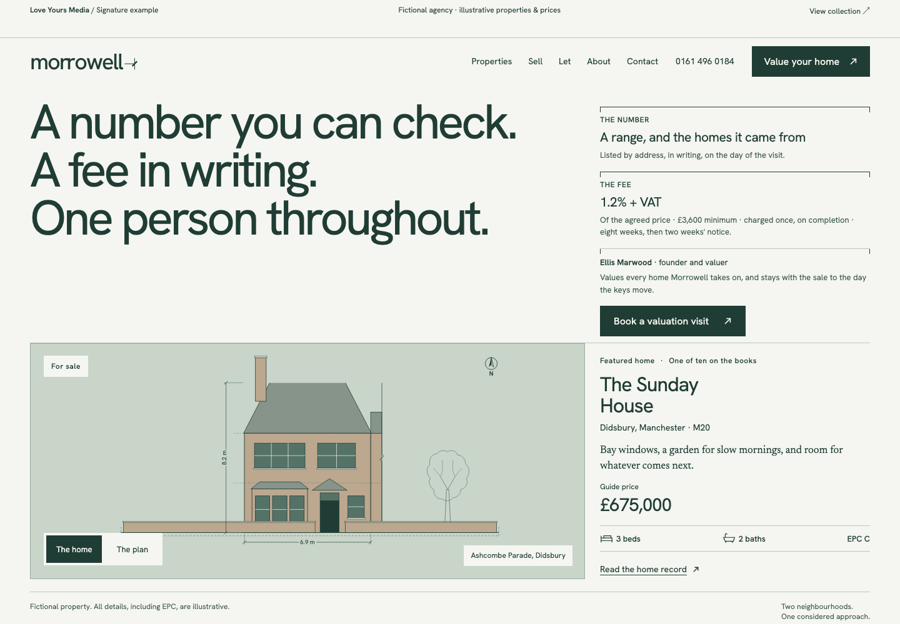
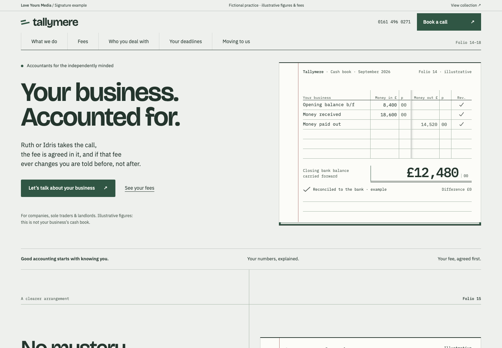

# Website design studies · Love Yours Media

**[Explore the website studies live](https://lym-loveyours.github.io/service-website-showcases/)**


Two complete, fictional business websites. Distinctive design, legible information and clear next steps.



**Morrowell:** a 10-page estate-agency study with architectural drawings, property filtering, floor plans and illustrative valuation interactions.



**Tallymere:** a 12-page accountancy study with a ledger-inspired identity, fee and sector journeys, and a browser-only enquiry demonstration.

## Run locally

Python 3 and Node.js 24 are required for the full QA workflow.

```sh
python3 -m http.server 9402 --bind 127.0.0.1
```

Open http://127.0.0.1:9402/ for the collection. No build, credentials or external font service is required.

```sh
npm ci
npx playwright install --with-deps chromium
npm test
```

The suite checks all 22 pages at desktop and mobile sizes, automated WCAG A/AA rules, page errors, failed assets, horizontal overflow and local links. See [QA scope](docs/QA.md). Automated accessibility checks are not a full accessibility audit.

## Design and implementation

Morrowell uses an architectural visual language: forest ink, fine rules, restrained diagrams and generous type. Tallymere uses cash-book geometry and typographic hierarchy to make dense information approachable. The collection uses the studio's light palette and original wordmark.

HTML, CSS and JavaScript are intentionally readable without a framework. Fonts and drawings are local. Reduced-motion preferences are respected. A content-security policy prevents form submission; a local handler validates and clears contact inputs without sending them.

## Provenance and boundaries

These are sanitised derivatives of existing LYM-authored blueprint work, not newly invented client commissions. `PROVENANCE.json` records the source tree and hashes of the 36 selected original files, all matched to the private source repository. Private history, internal documentation and operational configuration are excluded. Public adaptations include local fonts, isolated demo forms, accessible scroll regions and the collection page.

All businesses, people, listings, prices and outcomes are fictional. Financial/regulatory material is illustrative and must not be used as professional advice. No booking, email or lead delivery occurs. Use synthetic details only. The examples are not live businesses and do not represent measured commercial results.

Source is available for inspection; the original designs and LYM identity are not offered under an open-source licence. See [LICENCE](LICENCE.md) and [third-party notices](THIRD_PARTY.md).
